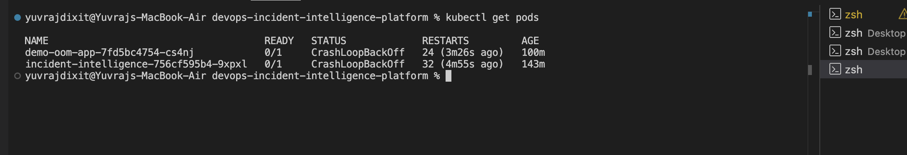
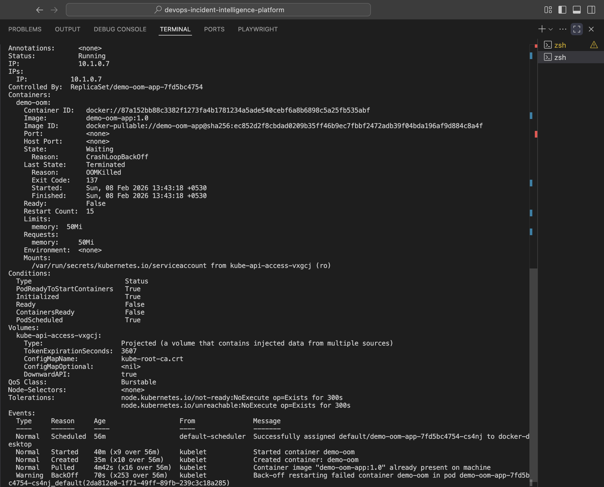
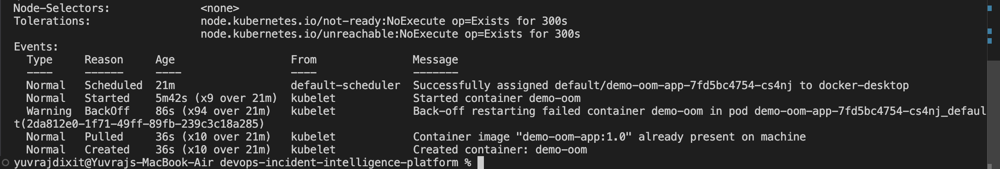

# DevOps Incident Intelligence Platform

## Overview
The DevOps Incident Intelligence Platform is a real-world DevOps tool that detects
production incidents by correlating Kubernetes failures and provides actionable
recommendations for DevOps engineers.

This project demonstrates real incident detection using Kubernetes pod failures
(OOMKilled) and automated incident analysis.

---

## Real Incident Demonstration

### 1. Kubernetes Pod Failure (OOMKilled)
A demo application was deployed with strict memory limits to intentionally
trigger an Out-Of-Memory (OOM) failure.

---

### 2. Root Cause Confirmation
Kubernetes explicitly terminated the pod due to memory exhaustion
(Exit Code 137).

---

### 3. Incident Intelligence Platform Output
The platform automatically detected the Kubernetes failure and generated
a remediation recommendation.

---

## How It Works
1. A demo app crashes due to memory limits in Kubernetes
2. Kubernetes records the OOMKilled event
3. The platform reads real pod status using kubectl
4. Incident timeline is generated
5. Actionable remediation is recommended

---

## Tech Stack
- Python
- Docker
- Jenkins (CI)
- DevSecOps (Secrets + Image Scanning)
- Kubernetes
- GitHub

---

## Key Learning
- Real Kubernetes incident detection
- Pod lifecycle and OOMKilled handling
- DevOps incident correlation
- Practical DevSecOps integration
- Evidence-driven GitHub documentation

---

## Author
**Yuvraj Dixit**
DevOps Engineer | Automation & Cloud Enthusiast
